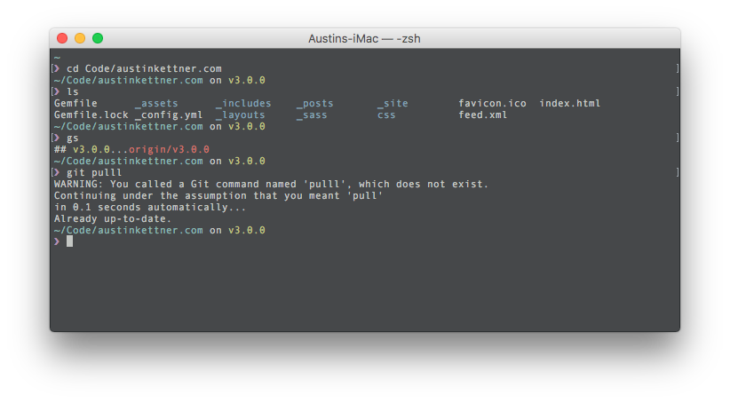

# Smooth Terminal Theme
A terminal theme for Mac OSX

## Preview

## How to use
1. Download the .terminal file
2. Open File directly OR Open Terminal.app > File > Preferences > Profile > Click the gear in the bottom left and select import

## Inspiration
1. Still trying to track down the original inspiration for this theme, it was another Github repo though.
